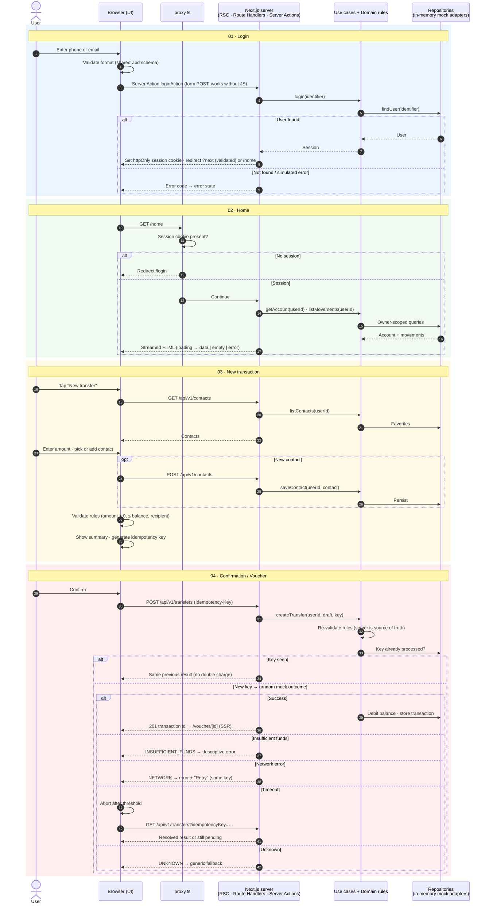

# Sequence Diagram — Main Workflow

Login → Home → New Transaction → Confirmation / Voucher.

```mermaid
sequenceDiagram
    autonumber
    actor U as User
    participant B as Browser (UI)
    participant P as proxy.ts
    participant N as Next.js server<br/>(RSC · Route Handlers · Server Actions)
    participant D as Use cases + Domain rules
    participant R as Repositories<br/>(in-memory mock adapters)

    %% ── 01 Login ──
    rect rgb(235, 245, 255)
        Note over U,R: 01 · Login
        U->>B: Enter phone or email
        B->>B: Validate format (shared Zod schema)
        B->>N: Server Action loginAction (form POST, works without JS)
        N->>D: login(identifier)
        D->>R: findUser(identifier)
        alt User found
            R-->>D: User
            D-->>N: Session
            N-->>B: Set httpOnly session cookie · redirect ?next (validated) or /home
        else Not found / simulated error
            N-->>B: Error code → error state
        end
    end

    %% ── 02 Home ──
    rect rgb(240, 250, 240)
        Note over U,R: 02 · Home
        B->>P: GET /home
        P->>P: Session cookie present?
        alt No session
            P-->>B: Redirect /login
        else Session
            P->>N: Continue
            N->>D: getAccount(userId) · listMovements(userId)
            D->>R: Owner-scoped queries
            R-->>D: Account + movements
            N-->>B: Streamed HTML (loading → data | empty | error)
        end
    end

    %% ── 03 New transaction ──
    rect rgb(255, 250, 230)
        Note over U,R: 03 · New transaction
        U->>B: Tap "New transfer"
        B->>N: GET /api/v1/contacts
        N->>D: listContacts(userId)
        D->>R: Favorites
        N-->>B: Contacts
        U->>B: Enter amount · pick or add contact
        opt New contact
            B->>N: POST /api/v1/contacts
            N->>D: saveContact(userId, contact)
            D->>R: Persist
        end
        B->>B: Validate rules (amount > 0, ≤ balance, recipient)
        B->>B: Show summary · generate idempotency key
    end

    %% ── 04 Confirmation / Voucher ──
    rect rgb(255, 238, 238)
        Note over U,R: 04 · Confirmation / Voucher
        U->>B: Confirm
        B->>N: POST /api/v1/transfers (Idempotency-Key)
        N->>D: createTransfer(userId, draft, key)
        D->>D: Re-validate rules (server is source of truth)
        D->>R: Key already processed?
        alt Key seen
            N-->>B: Same previous result (no double charge)
        else New key → random mock outcome
            alt Success
                D->>R: Debit balance · store transaction
                N-->>B: 201 transaction id → /voucher/[id] (SSR)
            else Insufficient funds
                N-->>B: INSUFFICIENT_FUNDS → descriptive error
            else Network error
                N-->>B: NETWORK → error + "Retry" (same key)
            else Timeout
                B->>B: Abort after threshold
                B->>N: GET /api/v1/transfers?idempotencyKey=…
                N-->>B: Resolved result or still pending
            else Unknown
                N-->>B: UNKNOWN → generic fallback
            end
        end
    end
```
